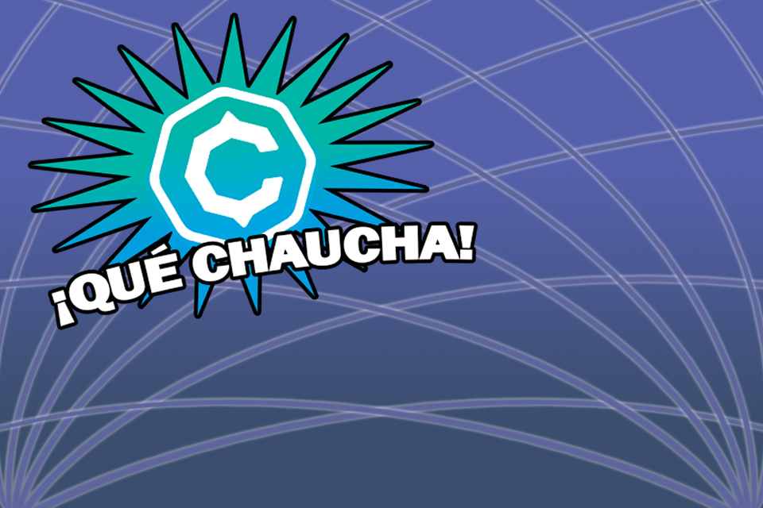

# ¡ Qué Chaucha !

El juego educativo que te prepara para rendir la certificación Bitcoin
[https://cryptoconsortium.org/certifications/CBP](https://cryptoconsortium.org/certifications/CBP)

## Contenido
El contenido se irá actualizando poco a poco.

- **60** preguntas presentes en el examen de certificación bitcoin.
- 4 pistas por palabra clave

## Juega
Responde *10* preguntas correctas y obtendrás una pista
para descubrir las *12* palabras.

[https://proyecto-chaucha.github.io/quechaucha/](https://proyecto-chaucha.github.io/quechaucha/)

## Concurso (Finalizado)

El primero en adivinar las *12* palabras podrá
desbloquear el archivo *wallet.dat* y ganar *100* CHA.

Revisa el twitter oficial para obtener novedades
[https://twitter.com/cryptochaucha](https://twitter.com/cryptochaucha)

Descarga el archivo [wallet.dat](https://github.com/proyecto-chaucha/quechaucha/releases/download/v1.0/wallet.dat)

[http://insight.chaucha.cl/address/cV1rxKiTHUvjx1FeX58tNAkgQgeKWPFm7S](http://insight.chaucha.cl/address/cV1rxKiTHUvjx1FeX58tNAkgQgeKWPFm7S)
